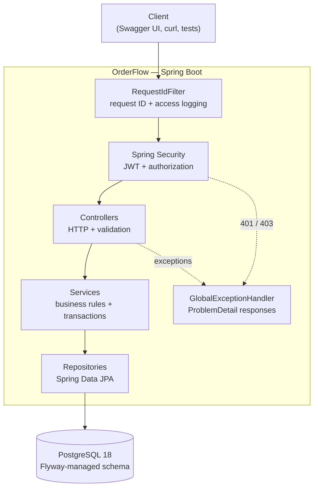
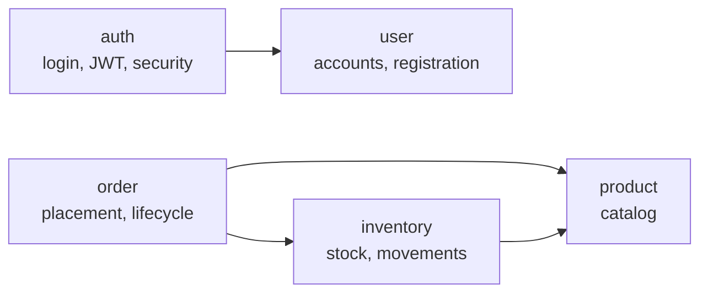
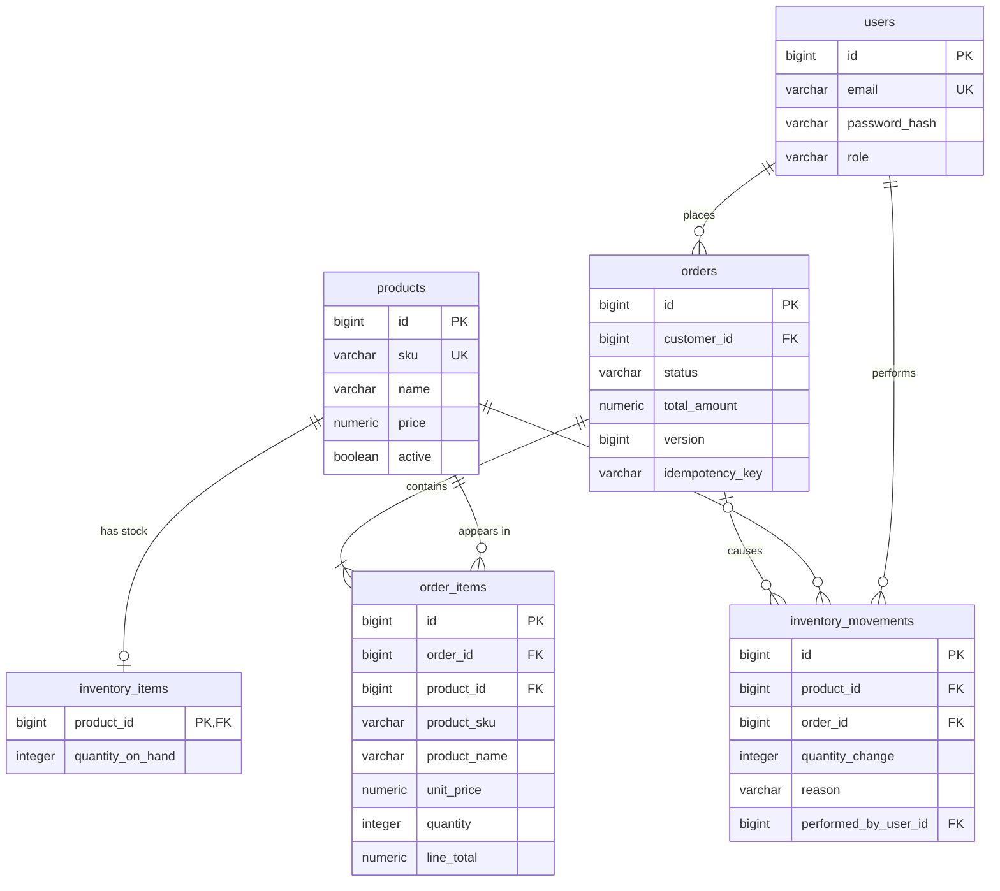
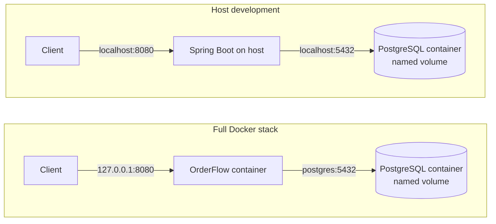
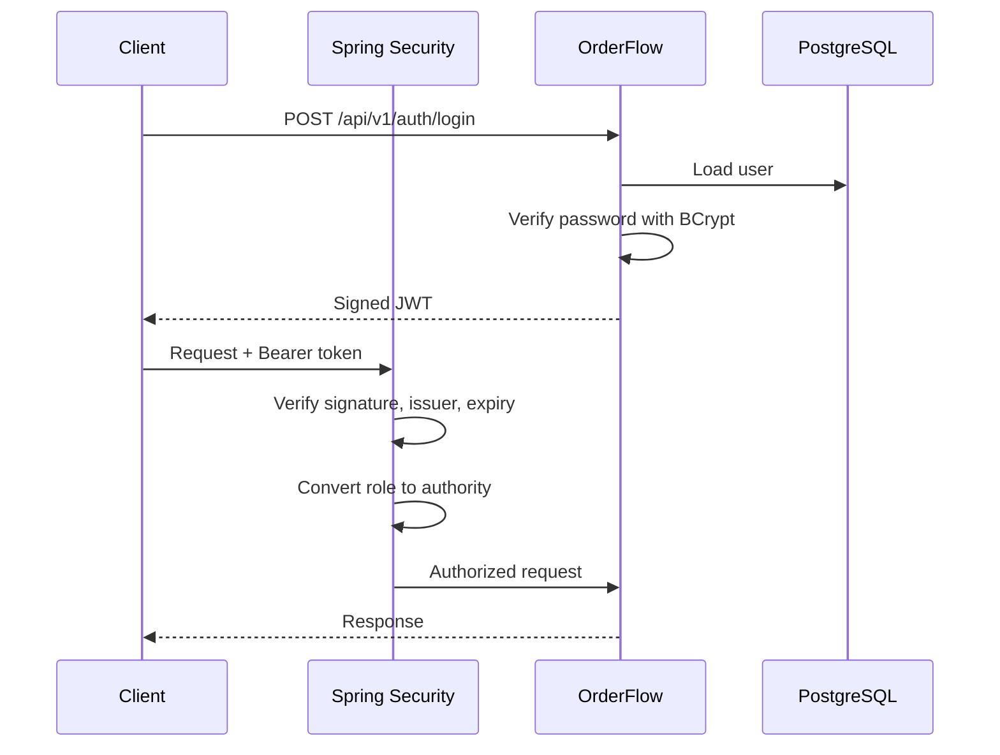

# OrderFlow

[](https://github.com/Levi-j/orderFlow-backend/actions/workflows/ci.yml)

OrderFlow is a Spring Boot backend for a small online store. It handles customer accounts, products, inventory, and orders, with most of the project focused on the parts of backend development where correctness matters more than simply exposing CRUD endpoints.

It's built to learn about problems such as transactional order placement, concurrent stock updates, safe retries, authentication and authorization, database migrations, and useful application logging.

The application is a modular monolith backed by PostgreSQL. It can run locally with the application on the host, or as a complete Docker Compose stack.


## Highlights

- **JWT authentication and role-based access** — customers and administrators use the same login flow, while Spring Security controls which routes each role can access.
- **Transactional order placement** — orders, order items, inventory changes, and inventory history are committed together or rolled back together.
- **Concurrency-safe inventory** — PostgreSQL performs stock changes atomically, so overlapping requests cannot drive inventory below zero.
- **Idempotent order creation** — clients can safely retry an order using the same `Idempotency-Key` without accidentally creating a duplicate.
- **Optimistic locking** — competing order status changes are detected instead of silently overwriting each other.
- **Historical order snapshots** — order items keep the SKU, product name, and price that existed when the order was placed.
- **Request correlation** — every response has an `X-Request-Id`, which is also included in error responses and logs.
- **Structured logging** — logs can be written as ECS-style JSON without an additional logging library.
- **Real PostgreSQL integration tests** — Testcontainers is used for database, API, transaction, idempotency, and concurrency testing.
- **Docker and CI** — the application has a multi-stage, non-root Docker image, and GitHub Actions verifies the project and builds the image.


## Tech Stack

- Java 21
- Spring Boot 4.1
- Spring MVC
- Spring Data JPA / Hibernate
- Spring Security
- Spring Boot Actuator
- JWT bearer authentication
- BCrypt password hashing
- PostgreSQL 18
- Flyway
- OpenAPI / Swagger UI
- Maven
- Docker and Docker Compose
- JUnit Jupiter
- REST Assured
- Testcontainers
- GitHub Actions


## Architecture

OrderFlow is a modular monolith: one Spring Boot application and one PostgreSQL database.

The code is organized primarily by business feature rather than by technical layer.



A normal request goes through the request-ID filter and Spring Security before reaching a controller. Controllers deal with HTTP concerns, while services contain the business rules and transaction boundaries. Repositories handle persistence.

The main feature dependencies look like this:



Shared infrastructure such as error handling, pagination, request correlation, and OpenAPI configuration lives under `common`.

Repositories are package-private where possible, so one business module cannot casually reach into another module's persistence layer. Cross-module communication goes through services instead.

The same idea applies to entities: cross-module references are stored as IDs rather than broad JPA object graphs. JPA relationships are used where they make sense inside an aggregate, such as an order and its order items.


## Database Schema



The diagram leaves out a few columns such as timestamps, descriptions, inventory notes, and the request fingerprint used for idempotency.

Products and inventory are deliberately separate. A product describes what can be sold, while `inventory_items` holds the current quantity. If a product has never had stock added, the application treats it as having zero inventory.

`inventory_movements` acts as the stock history. Manual adjustments point to the user who performed them, while movements caused by an order can also point back to that order.

Order items store a snapshot of the product's SKU, name, and price. That means changing a product later does not rewrite old orders.

Flyway owns the schema. Migrations live in:

```text
src/main/resources/db/migration
```

Hibernate runs with schema validation and does not create or alter production tables.

With PostgreSQL running, the tables can be inspected directly:

```powershell
docker compose exec postgres psql -U orderflow -d orderflow -c "\d products"
docker compose exec postgres psql -U orderflow -d orderflow -c "\d users"
docker compose exec postgres psql -U orderflow -d orderflow -c "\d inventory_items"
docker compose exec postgres psql -U orderflow -d orderflow -c "\d inventory_movements"
docker compose exec postgres psql -U orderflow -d orderflow -c "\d orders"
docker compose exec postgres psql -U orderflow -d orderflow -c "\d order_items"
```


## Running OrderFlow

There are two useful ways to run the project.



For simply trying the application, the full Docker stack is the easiest option.

For development, I usually run PostgreSQL in Docker and the Spring Boot application directly through Maven.


### Requirements

For the full Docker setup:

- Docker Desktop, or another Docker environment with Docker Compose

For host development and running the tests:

- JDK 21

A global Maven installation is not required because the repository includes the Maven Wrapper.

```powershell
java -version
```


### Configuration

Create a local `.env` file from the example:

```powershell
Copy-Item .env.example .env
```

On Linux or macOS:

```bash
cp .env.example .env
```

`.env.example` documents the settings the project expects. Real secrets belong in `.env`, which is ignored by Git and excluded from the Docker build context.


### JWT Signing Secret

JWT access tokens are signed using `ORDERFLOW_JWT_SECRET`.

The secret must be at least 32 bytes when encoded as UTF-8.

The public `.env.example` intentionally leaves it blank:

```text
ORDERFLOW_JWT_SECRET=
```

A random value can be generated in PowerShell:

```powershell
$bytes = New-Object byte[] 32
$rng = [System.Security.Cryptography.RandomNumberGenerator]::Create()
$rng.GetBytes($bytes)
$rng.Dispose()
[Convert]::ToBase64String($bytes)
```

Or with OpenSSL:

```bash
openssl rand -base64 32
```

Then add the generated value to `.env`:

```text
ORDERFLOW_JWT_SECRET=<generated value>
```

The application fails during startup if the secret is missing, blank, or too short.

Changing the secret also invalidates any JWTs signed with the previous value.


### Creating an Administrator

Public registration always creates a `CUSTOMER`.

The first administrator can optionally be created at startup through:

```text
ORDERFLOW_ADMIN_EMAIL=admin@example.com
ORDERFLOW_ADMIN_PASSWORD=<password>
```

Both values have to be present together. Leaving both blank disables the bootstrap. Supplying only one causes startup to fail instead of silently running with incomplete configuration.

The administrator password follows the same rules as customer passwords:

- at least 15 Unicode code points
- no more than 72 bytes when encoded as UTF-8

The bootstrap is create-once. If the admin already exists, restarting the application leaves the account unchanged. Changing the environment password later does not silently reset the stored password.

If the configured email already belongs to a `CUSTOMER`, startup fails rather than promoting that account.

There is no public administrator-registration endpoint.


### Running the Full Stack with Docker

Make sure `.env` exists and contains a valid JWT secret.

Then run:

```powershell
docker compose --profile app up --build -d
```

This builds the OrderFlow image, starts PostgreSQL, waits for PostgreSQL to become healthy, and then starts the application.

Check the containers:

```powershell
docker compose --profile app ps
```

Once the application has started:

```powershell
curl.exe http://localhost:8080/actuator/health
```

A healthy response contains:

```json
{
  "groups": [
    "liveness",
    "readiness"
  ],
  "status": "UP"
}
```

Swagger UI is available at:

```text
http://localhost:8080/swagger-ui.html
```

The API is bound to `127.0.0.1:8080`, so it is reachable from the local machine without being exposed to the rest of the network.

Container logs can be followed with:

```powershell
docker compose --profile app logs -f app
```

The application container uses structured JSON logging by default.

To stop the stack without deleting the database:

```powershell
docker compose --profile app down
```

Be careful with:

```powershell
docker compose down -v
```

The `-v` removes the PostgreSQL volume as well, which deletes the stored users, products, inventory, and orders.

The application service is behind the `app` Compose profile. Running:

```powershell
docker compose up -d
```

without the profile still starts **only PostgreSQL**. That is the normal setup for host development.

Inside the Compose network, the application connects to PostgreSQL using:

```text
postgres:5432
```

That is different from host development, where the application reaches PostgreSQL through:

```text
localhost:5432
```

`localhost` inside a container refers to that container itself, so using the Compose service name is what allows the two containers to communicate.

Secrets are passed into the application at runtime. They are not built into the Docker image.


### Building the Image Directly

The image can also be built without Compose:

```powershell
docker build -t orderflow:local .
```

The Dockerfile uses two stages.

The first stage has a Java 21 JDK and builds the application with the repository's Maven Wrapper.

The second stage has only a Java 21 JRE and the built application JAR. It runs under an unprivileged `orderflow` user rather than root.

Tests are not repeated during `docker build`; the test suite is run separately with Maven before the image is built in CI.

Building the image does not require PostgreSQL, `.env`, or any application secrets. Those are runtime concerns.


### Running on the Host

For development, start only PostgreSQL:

```powershell
docker compose up -d
docker compose ps
```

Wait for the `postgres` container to report as healthy.

The database is exposed locally at:

```text
127.0.0.1:5432
```

Make sure your `.env` contains `ORDERFLOW_JWT_SECRET`, then run:

```powershell
.\mvnw.cmd spring-boot:run
```

On Linux or macOS:

```bash
./mvnw spring-boot:run
```

The API will be available at:

```text
http://localhost:8080
```

Press `Ctrl+C` to stop the application.

When finished with PostgreSQL:

```powershell
docker compose down
```

The named database volume is preserved.


## API Overview

| Area | Endpoints | Access |
| --- | --- | --- |
| Health | `GET /actuator/health` | Public |
| API docs | `/swagger-ui.html`, `/v3/api-docs` | Public |
| Registration | `POST /api/v1/auth/register` | Public |
| Login | `POST /api/v1/auth/login` | Public |
| Product catalog | `GET /api/v1/products`, `GET /api/v1/products/{id}` | Public |
| Current user | `GET /api/v1/users/me` | Authenticated |
| Customer orders | `POST /api/v1/orders`, `GET /api/v1/orders`, `GET /api/v1/orders/{id}`, `POST /api/v1/orders/{id}/cancel` | `CUSTOMER` |
| Product management | `/api/v1/admin/products/**` | `ADMIN` |
| Inventory management | `/api/v1/admin/inventory/**` | `ADMIN` |
| Order management | `/api/v1/admin/orders/**` | `ADMIN` |


## API Documentation

Swagger UI is available while the application is running:

```text
http://localhost:8080/swagger-ui.html
```

The generated OpenAPI document is available at:

```text
http://localhost:8080/v3/api-docs
```

Both are public.

Public endpoints can be called immediately. To use a protected route in Swagger:

1. Call `POST /api/v1/auth/login`.
2. Copy the returned `accessToken`.
3. Click **Authorize**.
4. Paste the token into `bearerAuth`.
5. Call a protected endpoint.

Paste only the token. Swagger adds the `Bearer` prefix.

Swagger authorization does not bypass the application's role rules. A valid `CUSTOMER` token still receives `403 ACCESS_DENIED` on an administrator endpoint.


## Quick API Walkthrough

This example goes through the main application flow: register a customer, log in as the administrator, create a product, add stock, place an order, retry it safely, and cancel it.

It assumes an administrator has already been configured through the startup bootstrap.


### PowerShell

```powershell
$base = "http://localhost:8080"

curl.exe "$base/actuator/health"

# Register and log in as a customer
$customer = @{
    email = "alice@example.com"
    password = "alice uses a long passphrase"
} | ConvertTo-Json

Invoke-RestMethod `
    -Method Post `
    -Uri "$base/api/v1/auth/register" `
    -ContentType "application/json" `
    -Body $customer

$customerToken = (
    Invoke-RestMethod `
        -Method Post `
        -Uri "$base/api/v1/auth/login" `
        -ContentType "application/json" `
        -Body $customer
).accessToken

# Log in as the administrator
$adminPassword = Read-Host "Admin password" -AsSecureString

$adminLogin = @{
    email = "admin@example.com"
    password = [System.Net.NetworkCredential]::new("", $adminPassword).Password
} | ConvertTo-Json

$adminToken = (
    Invoke-RestMethod `
        -Method Post `
        -Uri "$base/api/v1/auth/login" `
        -ContentType "application/json" `
        -Body $adminLogin
).accessToken

$adminHeaders = @{
    Authorization = "Bearer $adminToken"
}

# Create a product
$product = Invoke-RestMethod `
    -Method Post `
    -Uri "$base/api/v1/admin/products" `
    -Headers $adminHeaders `
    -ContentType "application/json" `
    -Body (@{
        sku = "KEYBOARD-1"
        name = "Keyboard"
        price = 49.90
    } | ConvertTo-Json)

# Add stock
Invoke-RestMethod `
    -Method Post `
    -Uri "$base/api/v1/admin/inventory/$($product.id)/adjustments" `
    -Headers $adminHeaders `
    -ContentType "application/json" `
    -Body (@{
        quantityChange = 10
        reason = "RESTOCK"
    } | ConvertTo-Json)

# Place an order
$orderHeaders = @{
    Authorization = "Bearer $customerToken"
    "Idempotency-Key" = [guid]::NewGuid().ToString()
}

$orderBody = @{
    items = @(
        @{
            productId = $product.id
            quantity = 2
        }
    )
} | ConvertTo-Json -Depth 3

$order = Invoke-RestMethod `
    -Method Post `
    -Uri "$base/api/v1/orders" `
    -Headers $orderHeaders `
    -ContentType "application/json" `
    -Body $orderBody

# Retry the exact same request
$retry = Invoke-WebRequest `
    -Method Post `
    -Uri "$base/api/v1/orders" `
    -Headers $orderHeaders `
    -ContentType "application/json" `
    -Body $orderBody `
    -UseBasicParsing

$retry.Headers["Idempotent-Replayed"]

# Read and cancel the order
$customerHeaders = @{
    Authorization = "Bearer $customerToken"
}

Invoke-RestMethod `
    -Uri "$base/api/v1/orders/$($order.id)" `
    -Headers $customerHeaders

(
    Invoke-RestMethod `
        -Method Post `
        -Uri "$base/api/v1/orders/$($order.id)/cancel" `
        -Headers $customerHeaders
).status

(
    Invoke-RestMethod `
        -Uri "$base/api/v1/admin/inventory/$($product.id)" `
        -Headers $adminHeaders
).quantityOnHand
```

The retry should return:

```text
Idempotent-Replayed: true
```

After cancellation, the order is `CANCELLED` and the two units are returned to inventory, bringing the product back to 10.


### Bash

The Bash example uses `curl` and `jq`.

```bash
BASE=http://localhost:8080

curl "$BASE/actuator/health"

# Register and log in as a customer
CUSTOMER='{"email":"alice@example.com","password":"alice uses a long passphrase"}'

curl -s -X POST "$BASE/api/v1/auth/register" \
  -H "Content-Type: application/json" \
  -d "$CUSTOMER"

CUSTOMER_TOKEN=$(
  curl -s -X POST "$BASE/api/v1/auth/login" \
    -H "Content-Type: application/json" \
    -d "$CUSTOMER" |
  jq -r .accessToken
)

# Log in as the administrator
read -rsp "Admin password: " ADMIN_PASSWORD
echo

ADMIN_TOKEN=$(
  jq -n \
    --arg email "admin@example.com" \
    --arg password "$ADMIN_PASSWORD" \
    '{email: $email, password: $password}' |
  curl -s -X POST "$BASE/api/v1/auth/login" \
    -H "Content-Type: application/json" \
    -d @- |
  jq -r .accessToken
)

# Create a product
PRODUCT_ID=$(
  curl -s -X POST "$BASE/api/v1/admin/products" \
    -H "Authorization: Bearer $ADMIN_TOKEN" \
    -H "Content-Type: application/json" \
    -d '{"sku":"KEYBOARD-1","name":"Keyboard","price":49.90}' |
  jq -r .id
)

# Add stock
curl -s -X POST "$BASE/api/v1/admin/inventory/$PRODUCT_ID/adjustments" \
  -H "Authorization: Bearer $ADMIN_TOKEN" \
  -H "Content-Type: application/json" \
  -d '{"quantityChange":10,"reason":"RESTOCK"}'

# Place an order
KEY="checkout-$(date +%s)"
ORDER="{\"items\":[{\"productId\":$PRODUCT_ID,\"quantity\":2}]}"

ORDER_ID=$(
  curl -s -X POST "$BASE/api/v1/orders" \
    -H "Authorization: Bearer $CUSTOMER_TOKEN" \
    -H "Idempotency-Key: $KEY" \
    -H "Content-Type: application/json" \
    -d "$ORDER" |
  jq -r .id
)

# Retry the same order
curl -s -D - -o /dev/null -X POST "$BASE/api/v1/orders" \
  -H "Authorization: Bearer $CUSTOMER_TOKEN" \
  -H "Idempotency-Key: $KEY" \
  -H "Content-Type: application/json" \
  -d "$ORDER" |
grep -i "idempotent-replayed"

# Read and cancel it
curl -s "$BASE/api/v1/orders/$ORDER_ID" \
  -H "Authorization: Bearer $CUSTOMER_TOKEN"

curl -s -X POST "$BASE/api/v1/orders/$ORDER_ID/cancel" \
  -H "Authorization: Bearer $CUSTOMER_TOKEN"

curl -s "$BASE/api/v1/admin/inventory/$PRODUCT_ID" \
  -H "Authorization: Bearer $ADMIN_TOKEN"
```

Passwords and tokens stay in shell variables rather than being printed deliberately.

Because customer emails and SKUs are unique, use different values when repeating the walkthrough.


## Products

Anyone can browse active products:

```text
GET /api/v1/products
GET /api/v1/products/{id}
```

Administrators can manage the complete catalog, including inactive products:

```text
POST /api/v1/admin/products
PUT  /api/v1/admin/products/{id}
GET  /api/v1/admin/products
GET  /api/v1/admin/products/{id}
```

Product lists support pagination and sorting:

```text
GET /api/v1/products?page=0&size=20&sort=name,asc
```

The default page size is 20 and the maximum is 100.

A page response looks like:

```json
{
  "content": [],
  "page": 0,
  "size": 20,
  "totalElements": 0,
  "totalPages": 0
}
```

SKUs are unique and normalized to uppercase. For example:

```text
keyboard-1
```

is stored as:

```text
KEYBOARD-1
```

A product's name, description, price, and active state can be updated, but its SKU cannot be changed after creation.

Products are not deleted. Setting `active` to `false` removes a product from the public catalog while keeping it available to administrators and preserving references from historical orders.


### Validation and Errors

Request bodies are validated before business logic runs.

Invalid input returns HTTP `400`. Examples include malformed JSON, blank names, invalid prices, invalid order quantities, or a missing/invalid idempotency key.

Errors use `application/problem+json`.

A validation response looks like:

```json
{
  "status": 400,
  "title": "Bad Request",
  "detail": "Request validation failed",
  "instance": "/api/v1/admin/products",
  "code": "VALIDATION_FAILED",
  "requestId": "4f6c1e0a-8b2d-4d7e-9a35-2c1b7e5f9d10",
  "errors": [
    {
      "field": "name",
      "message": "must not be blank"
    }
  ]
}
```

The `code` is intended for programmatic handling, while `requestId` can be used to find the request in the server logs.

| Status | Meaning |
| --- | --- |
| `400` | Invalid or malformed request |
| `401` | Authentication is missing, invalid, or login failed |
| `403` | Authenticated but not allowed to use the endpoint |
| `404` | Resource not found |
| `405` | HTTP method not supported |
| `406` | Requested response type not supported |
| `409` | Conflict with the current application state |
| `415` | Unsupported request content type |
| `500` | Unexpected server error |

Application error codes include:

```text
VALIDATION_FAILED
MALFORMED_REQUEST
RESOURCE_NOT_FOUND
DUPLICATE_SKU
INSUFFICIENT_STOCK
PRODUCT_NOT_AVAILABLE
INVALID_STATUS_TRANSITION
CONCURRENT_MODIFICATION
IDEMPOTENCY_KEY_REUSED
IDEMPOTENCY_KEY_IN_USE
EMAIL_ALREADY_REGISTERED
INVALID_CREDENTIALS
UNAUTHENTICATED
ACCESS_DENIED
```

Clients never receive stack traces, Java exception names, raw SQL, or database constraint messages.


## Inventory

Product information and stock are kept separate.

A product tells the application what is being sold. Inventory tells it how many units are currently available.

Inventory endpoints are administrator-only:

```text
GET  /api/v1/admin/inventory/{productId}
POST /api/v1/admin/inventory/{productId}/adjustments
GET  /api/v1/admin/inventory/{productId}/movements
```


### Current Stock

```text
GET /api/v1/admin/inventory/{productId}
```

A product that has never had an inventory row is treated as having zero stock.

```json
{
  "productId": 1,
  "quantityOnHand": 0
}
```


### Adjusting Stock

A positive `quantityChange` adds units and a negative value removes them.

```powershell
$body = @{
    quantityChange = 10
    reason = "RESTOCK"
    note = "Initial delivery"
} | ConvertTo-Json

Invoke-RestMethod `
    -Uri http://localhost:8080/api/v1/admin/inventory/1/adjustments `
    -Method Post `
    -Headers @{ Authorization = "Bearer $token" } `
    -ContentType "application/json" `
    -Body $body
```

A successful response contains the new quantity:

```json
{
  "productId": 1,
  "quantityOnHand": 10
}
```

Manual adjustments accept two reasons:

- `RESTOCK` — adding stock; the quantity change must be positive
- `ADJUSTMENT` — correcting inventory in either direction

A zero change is rejected.

Inventory is never allowed to become negative. The application performs stock changes with a conditional PostgreSQL update, and the table also has a database constraint as a final safety net.

If an adjustment would make the quantity negative, the API returns HTTP `409`:

```text
INSUFFICIENT_STOCK
```

No stock is changed and no movement is recorded.

Orders use the same inventory mechanism. Placing an order creates `ORDER_PLACED` movements; cancelling one creates `ORDER_CANCELLED` movements and returns the reserved stock.

Those movement reasons are internal to the order workflow and cannot be submitted through the manual inventory endpoint.


### Movement History

Every successful stock change creates an inventory movement.

```text
GET /api/v1/admin/inventory/{productId}/movements
```

The history is paginated and returned newest first.

A movement records information such as:

- the quantity change
- the reason
- an optional note
- the user responsible
- the related order, when applicable
- the time it happened

The stock change and movement record are part of the same transaction, so the current quantity and its history cannot be committed separately.


## Orders

Customer order endpoints are:

```text
POST /api/v1/orders
GET  /api/v1/orders
GET  /api/v1/orders/{id}
POST /api/v1/orders/{id}/cancel
```

They require a `CUSTOMER` access token.

An administrator token does not act as a customer token. An authenticated `ADMIN` receives `403` on customer-order routes.


### Placing an Order

The customer sends only product IDs and quantities.

```powershell
$body = @{
    items = @(
        @{ productId = 1; quantity = 2 }
        @{ productId = 2; quantity = 1 }
    )
} | ConvertTo-Json -Depth 3

$idempotencyKey = [guid]::NewGuid().ToString()

$order = Invoke-RestMethod `
    -Uri http://localhost:8080/api/v1/orders `
    -Method Post `
    -Headers @{
        Authorization = "Bearer $token"
        "Idempotency-Key" = $idempotencyKey
    } `
    -ContentType "application/json" `
    -Body $body
```

The client does not send prices, totals, or a customer ID.

OrderFlow takes the customer from the authenticated token, loads the current products, snapshots their data, and calculates the prices and totals itself.

Orders contain between 1 and 50 items. Each quantity must be between 1 and 1000, and a product cannot appear twice in the same order.

A successful placement returns HTTP `201` and a `Location` header.

```json
{
  "id": 1,
  "customerId": 2,
  "status": "PENDING",
  "totalAmount": 119.79,
  "createdAt": "2026-10-08T09:15:02.418532Z",
  "updatedAt": "2026-10-08T09:15:02.418532Z",
  "items": [
    {
      "productId": 1,
      "productSku": "KEYBOARD-1",
      "productName": "Keyboard",
      "unitPrice": 49.90,
      "quantity": 2,
      "lineTotal": 99.80
    },
    {
      "productId": 2,
      "productSku": "MOUSE-1",
      "productName": "Mouse",
      "unitPrice": 19.99,
      "quantity": 1,
      "lineTotal": 19.99
    }
  ]
}
```

Every new order starts as `PENDING`.


### Transactions and Stock

Placing an order touches several tables:

- the order
- its items
- current inventory
- inventory movement history

They are all updated inside one database transaction.

If every step succeeds, they are committed together.

If something fails, the transaction rolls back as a whole.

For example, lets say an order has two products and the first one has enough stock but the second one does not. OrderFlow may reach the first stock update before discovering the shortage on the second product, but the eventual rollback also undoes that first change. There is no partial order and no partial inventory deduction left behind.

Insufficient stock returns HTTP `409`:

```text
INSUFFICIENT_STOCK
```

A product that is missing or no longer active returns:

```text
PRODUCT_NOT_AVAILABLE
```

also with HTTP `409`.

Stock deduction itself is performed atomically by PostgreSQL. The update succeeds only if enough units still exist at the moment the database executes it.

That matters under concurrency. If three units remain and eight orders arrive at the same time, only three can successfully claim one. The others receive `INSUFFICIENT_STOCK`, and inventory never goes negative.


### Safe Retries

Order placement requires an `Idempotency-Key`.

This handles a common failure case: the server successfully creates an order, but the client loses the connection before receiving the response. Without idempotency, retrying might create another order and deduct stock twice.

A key must contain 1–100 characters from:

```text
A-Z
a-z
0-9
_
-
```

Keys are case-sensitive and scoped to the authenticated customer.

If the same customer sends the same key with the same products and quantities, the request is treated as a replay.

OrderFlow returns the original order again with HTTP `201` and:

```text
Idempotent-Replayed: true
```

It does not create another order, deduct stock again, or create another `ORDER_PLACED` movement.

Item order in the JSON does not matter. Requests with the same product IDs and quantities produce the same request fingerprint even if the items are listed in a different order.

If the same key is reused for different products or quantities, the request is rejected:

```text
IDEMPOTENCY_KEY_REUSED
```

with HTTP `409`.

There is one extra case when duplicate requests arrive at almost exactly the same time. Both may start before either transaction finishes.

A database uniqueness constraint guarantees that only one order can win for a given customer and idempotency key. The other request receives:

```text
IDEMPOTENCY_KEY_IN_USE
```

with HTTP `409`.

The client can then retry the same request. Once the winning transaction has committed, the retry resolves to the existing order normally.

If the original placement fails entirely, such as because of insufficient stock, the transaction rolls back and the key is not permanently consumed.

Idempotency keys currently do not expire.


### Order History

Order items are historical snapshots rather than live views of the product table.

Each item keeps:

- product ID
- SKU
- product name
- unit price
- quantity
- line total

If a keyboard costs `49.90` when an order is placed and an administrator later changes it to `59.90`, the old order still shows `49.90`.

That makes an order behave more like a receipt.


### Viewing Orders

```text
GET /api/v1/orders
```

returns the current customer's order history, newest first, using pagination.

```text
GET /api/v1/orders?page=0&size=20
```

The list uses summaries rather than loading every order item.

```text
GET /api/v1/orders/{id}
```

returns one order together with its items.

Customers can only see their own orders.

Requesting another customer's order returns the same `404` used for a nonexistent order. This avoids revealing whether the other order exists.


### Order Status

Orders have three states:

| Status | Meaning |
| --- | --- |
| `PENDING` | Placed and waiting for a decision |
| `CONFIRMED` | Accepted by an administrator |
| `CANCELLED` | Cancelled by the customer or an administrator |

Only a `PENDING` order can change state.

| Current state | Confirm | Cancel |
| --- | --- | --- |
| `PENDING` | `CONFIRMED` by admin | `CANCELLED` by customer or admin |
| `CONFIRMED` | rejected | rejected |
| `CANCELLED` | rejected | rejected |

`CONFIRMED` and `CANCELLED` are terminal.

An invalid transition returns HTTP `409`:

```text
INVALID_STATUS_TRANSITION
```


### Cancelling an Order

A customer can cancel their own pending order:

```text
POST /api/v1/orders/{id}/cancel
```

Cancellation keeps the order and its items in history, but changes the state to `CANCELLED`.

The important side effect is inventory restoration.

If an order reserved two keyboards, cancelling it adds those two units back and records an `ORDER_CANCELLED` movement.

The status change, stock restoration, and movement history all belong to one transaction. They either all succeed or all roll back.

Cancellation also works if a product was deactivated after the order was created. The order already contains the product ID and quantity needed to restore inventory.

Cancelling the same order twice is not allowed. The second attempt receives `INVALID_STATUS_TRANSITION`, and stock is not returned a second time.


### Administrator Order Management

Administrators can work with orders from all customers:

```text
GET  /api/v1/admin/orders
GET  /api/v1/admin/orders/{id}
POST /api/v1/admin/orders/{id}/confirm
POST /api/v1/admin/orders/{id}/cancel
```

The list can be filtered by status:

```text
GET /api/v1/admin/orders?status=PENDING
GET /api/v1/admin/orders?status=CONFIRMED
GET /api/v1/admin/orders?status=CANCELLED
```

Admin summaries include the customer ID.

Confirming a pending order changes it to `CONFIRMED`. Inventory does not change at confirmation time because it was already deducted when the order was placed.

Administrator cancellation behaves like customer cancellation: stock is restored and `ORDER_CANCELLED` movements are recorded.

The movement records also capture the administrator's user ID, making an administrative cancellation distinguishable from one performed by the customer.


### Concurrent Order Changes

Order status changes use optimistic locking.

Each order has an internal version number. When two requests load the same version and then both try to update it, only one can succeed.

For example, a customer could try to cancel an order at the same time an administrator tries to confirm it.

If one operation finishes before the other reads the order, the normal state-transition rule rejects the second operation with:

```text
INVALID_STATUS_TRANSITION
```

If both requests read the same old version before either writes, the stale update is rejected with:

```text
CONCURRENT_MODIFICATION
```

and HTTP `409`.

This is particularly important for cancellation because cancellation restores inventory. A stale cancellation must never be allowed to return the same stock twice.


## User Registration

Customers register through:

```text
POST /api/v1/auth/register
```

Example:

```powershell
$body = @{
    email = "jane.doe@example.com"
    password = "a long passphrase works well"
} | ConvertTo-Json

Invoke-RestMethod `
    -Uri http://localhost:8080/api/v1/auth/register `
    -Method Post `
    -ContentType "application/json" `
    -Body $body
```

A successful response contains:

```json
{
  "id": 1,
  "email": "jane.doe@example.com",
  "role": "CUSTOMER",
  "createdAt": "2026-10-07T20:22:59.547896Z"
}
```

Registration always creates a `CUSTOMER`; the caller cannot choose a role.

Emails are normalized to lowercase, so:

```text
Jane.Doe@Example.com
```

and:

```text
jane.doe@example.com
```

refer to the same account.

Trying to register the same email again returns HTTP `409`:

```text
EMAIL_ALREADY_REGISTERED
```

Passwords are stored using BCrypt. The raw password is never stored or returned.

The password policy is intentionally simple:

- minimum 15 Unicode code points
- maximum 72 bytes when encoded as UTF-8
- no uppercase, numeric, or symbol requirement

The byte limit matters because BCrypt's traditional input limit is based on bytes, not Java character count. Plain ASCII therefore allows up to 72 characters, while characters such as `€` or emoji consume several UTF-8 bytes each.


## Authentication

Users log in through:

```text
POST /api/v1/auth/login
```

The same endpoint handles both customers and administrators.

```powershell
$body = @{
    email = "jane.doe@example.com"
    password = "a long passphrase works well"
} | ConvertTo-Json

$login = Invoke-RestMethod `
    -Uri http://localhost:8080/api/v1/auth/login `
    -Method Post `
    -ContentType "application/json" `
    -Body $body
```

A successful response looks like:

```json
{
  "accessToken": "<JWT>",
  "tokenType": "Bearer",
  "expiresIn": 1800
}
```

Use the token in subsequent requests:

```text
Authorization: Bearer <token>
```

For example:

```powershell
$token = $login.accessToken

Invoke-RestMethod `
    -Uri http://localhost:8080/api/v1/users/me `
    -Headers @{ Authorization = "Bearer $token" }
```

Access tokens are valid for 30 minutes.

There are no refresh tokens. Once a token expires, the user logs in again.

The JWT uses the database user ID as its subject and carries the user's role. It does not contain the user's email or password.

A failed login returns HTTP `401`:

```text
INVALID_CREDENTIALS
```

The response is deliberately identical whether the email is unknown or the password is wrong.

Missing, expired, tampered, or otherwise invalid bearer tokens produce:

```text
UNAUTHENTICATED
```

with HTTP `401`.


### How Authentication Works



The flow is straightforward:

1. A customer registers and only a BCrypt hash of their password is stored.
2. Login goes through Spring Security's `AuthenticationManager`.
3. After successful authentication, OrderFlow creates an HS256-signed JWT containing the user ID, role, issuer, issue time, and expiry.
4. The client sends that token in the `Authorization` header.
5. Spring Security verifies the token before the request reaches protected application code.
6. The role claim becomes either `ROLE_CUSTOMER` or `ROLE_ADMIN`, which is then used by the route rules.

The application is stateless and does not use login sessions.

Because the role is part of the signed JWT, changing a user's role in the database would not affect a token that has already been issued. A new login is required to receive a token carrying the new role.


## Roles and Access

OrderFlow has two roles:

- `CUSTOMER`
- `ADMIN`

The main access rules are:

| Access | Routes |
| --- | --- |
| Public | `POST /api/v1/auth/register` |
| Public | `POST /api/v1/auth/login` |
| Public | `GET /api/v1/products` |
| Public | `GET /api/v1/products/{id}` |
| Public | `GET /actuator/health` |
| Public | `/v3/api-docs/**`, `/swagger-ui/**` |
| Authenticated | `GET /api/v1/users/me` |
| `ADMIN` | `/api/v1/admin/**` |
| `CUSTOMER` | `/api/v1/orders/**` |

`401` and `403` have different meanings.

`401 UNAUTHENTICATED` means the request has no valid authenticated user.

`403 ACCESS_DENIED` means authentication succeeded, but that user does not have permission to use the route.

For example:

```json
{
  "status": 403,
  "title": "Forbidden",
  "detail": "You do not have permission to access this resource.",
  "instance": "/api/v1/admin/products",
  "code": "ACCESS_DENIED",
  "requestId": "9d2e7a41-3c5b-4f08-b6a1-0e8f4d2c7b93"
}
```

## Request IDs and Logging

Every HTTP response includes:

```text
X-Request-Id
```

The same ID is placed in the logging context while the request is being processed.

This makes troubleshooting much easier: someone reporting an API error can provide the request ID, and that exact value can be searched in the server logs.

Clients may supply their own ID:

```powershell
$response = Invoke-WebRequest `
    -Uri http://localhost:8080/actuator/health `
    -Headers @{ "X-Request-Id" = "demo-123" } `
    -UseBasicParsing

$response.Headers["X-Request-Id"]
```

which returns:

```text
demo-123
```

Client-provided IDs can contain letters, digits, `_`, and `-`, with a maximum length of 64 characters.

If the header is missing or invalid, OrderFlow generates a UUID instead. The bad value is neither echoed back nor logged.

Error responses include the same ID:

```json
{
  "status": 404,
  "title": "Not Found",
  "detail": "Product 999999 not found",
  "instance": "/api/v1/products/999999",
  "code": "RESOURCE_NOT_FOUND",
  "requestId": "demo-123"
}
```

The `requestId` in the error body matches the `X-Request-Id` response header.


### Application Logs

Every HTTP request produces one concise access log after it finishes.

It contains:

- method
- path
- status
- duration

For example:

```text
2026-10-08T10:56:12.215+02:00 INFO ... [demo-123] ... RequestIdFilter : HTTP request eventName=http.request method=GET path=/actuator/health status=200 durationMs=4
```

The query string is intentionally not logged.

A request to:

```text
GET /api/v1/products?page=0&size=20
```

is logged only as:

```text
path=/api/v1/products
```

Useful business operations also produce structured events:

| Event | Level | Meaning |
| --- | --- | --- |
| `user.registered` | `INFO` | Customer account created |
| `auth.login_failed` | `WARN` | Login failed |
| `product.created` | `INFO` | Product created |
| `product.updated` | `INFO` | Product updated |
| `inventory.adjusted` | `INFO` | Stock manually changed |
| `inventory.insufficient_stock` | `WARN` | Stock change rejected |
| `order.placed` | `INFO` | Order created |
| `order.idempotent_replay` | `INFO` | Existing order replayed |
| `order.confirmed` | `INFO` | Order confirmed |
| `order.cancelled` | `INFO` | Order cancelled |

An order event might look like:

```text
Order placed eventName=order.placed orderId=12 customerId=5
```

`eventName` is intentionally used instead of a plain `event` field because ECS already reserves `event` as a structured field set.

Logs avoid values that would be risky or unnecessary to retain. The application does not intentionally log:

- passwords or password hashes
- email addresses
- JWTs
- `Authorization` headers
- request or response bodies
- query strings
- idempotency keys
- request fingerprints
- inventory notes
- cookies

Unexpected server errors are logged with a stack trace and request ID, while clients still receive a generic `INTERNAL_ERROR` response.

The logs are for troubleshooting, not as an audit database. PostgreSQL remains the source of truth for users, orders, inventory, and inventory movements.


### Structured JSON Logs

Plain text is the default when running the application directly because it is easier to read while developing.

Structured logging can be enabled with Spring Boot's built-in ECS support:

```powershell
$env:LOGGING_STRUCTURED_FORMAT_CONSOLE = "ecs"
.\mvnw.cmd spring-boot:run
```

An access log then looks like:

```json
{
  "@timestamp": "2026-10-08T08:56:41.152615600Z",
  "log": {
    "level": "INFO",
    "logger": "io.github.levij.orderflow.common.web.RequestIdFilter"
  },
  "process": {
    "pid": 11404,
    "thread": {
      "name": "http-nio-8080-exec-3"
    }
  },
  "service": {
    "name": "orderflow",
    "node": {}
  },
  "message": "HTTP request",
  "requestId": "json-demo-123",
  "eventName": "http.request",
  "method": "GET",
  "path": "/actuator/health",
  "status": 200,
  "durationMs": 5,
  "ecs": {
    "version": "8.11"
  }
}
```

Fields such as `requestId`, `eventName`, `orderId`, and `status` remain separate JSON properties, which makes the logs easier to search or process later.

Return to normal text logging with:

```powershell
Remove-Item Env:LOGGING_STRUCTURED_FORMAT_CONSOLE
```

The Docker Compose `app` service enables ECS JSON automatically, so container logs can be viewed with:

```powershell
docker compose --profile app logs app
```


## Testing

There are two main test commands.

For the fast, Docker-free suite:

```powershell
.\mvnw.cmd test
```

Tests named `*Test` run through Maven Surefire.

They cover things such as:

- validation and error handling
- authorization rules
- password validation
- administrator bootstrap
- JWT configuration
- order calculations
- order lifecycle rules
- request fingerprinting
- request-ID handling
- logging behavior

For the complete verification build:

```powershell
.\mvnw.cmd clean verify
```

Integration tests use the `*IT` naming convention and run through Maven Failsafe.

They start temporary PostgreSQL databases using Testcontainers, so Docker must be available. They do **not** use the PostgreSQL database from the local Compose stack.

The integration suite covers the full HTTP and persistence behavior, including:

- PostgreSQL constraints
- product creation and updates
- registration and login
- JWT authentication
- role authorization
- inventory adjustments and movement history
- non-negative inventory guarantees
- transactional order placement
- server-calculated pricing
- order snapshots
- rollback of failed multi-item orders
- customer ownership isolation
- order cancellation and confirmation
- inventory restoration
- optimistic locking
- idempotent retries
- conflicting idempotency keys
- simultaneous duplicate requests
- customers racing for limited inventory
- concurrent inventory adjustments
- request IDs on success and error responses
- logging safety
- generated OpenAPI documentation
- Swagger UI availability

The concurrency tests use real PostgreSQL transactions. They assert the final database state rather than assuming which request or thread should win a race.

Tests provide their own JWT configuration and test-only administrator credentials, so they do not depend on local `.env` secrets.

GitHub Actions runs the full verification build on Linux for pushes and pull requests targeting `main`.

After the Maven build succeeds, CI also builds the Docker image:

```text
docker build --tag orderflow:ci .
```

The CI workflow does not publish the image or deploy the application.


## Health Check

Spring Boot Actuator exposes:

```text
GET /actuator/health
```

Check it with:

```powershell
curl.exe http://localhost:8080/actuator/health
```

A healthy application returns:

```json
{
  "groups": [
    "liveness",
    "readiness"
  ],
  "status": "UP"
}
```

The health check includes PostgreSQL.

If the database becomes unavailable while the application is running, health changes to `DOWN` and the endpoint returns HTTP `503`.

Only the health endpoint is exposed through Actuator.


## Design Decisions


### Modular monolith instead of microservices

Order placement changes orders, order items, inventory, and inventory history together. Keeping those operations in one application and one database lets them use a normal local transaction instead of introducing distributed transaction problems.

The feature packages still provide useful boundaries without requiring separate services.


### Flyway owns the schema

Database changes are explicit SQL migrations. Hibernate validates the mappings against that schema rather than changing it automatically.

Once a migration has been applied, it is treated as immutable. Later schema changes go into new migrations.


### The database is part of the correctness model

Validation in Java gives clients useful API errors, but important rules are also protected by PostgreSQL constraints.

Examples include unique SKUs and emails, non-negative inventory, valid status values, and valid order totals.

That way, correctness does not rely entirely on one application code path behaving perfectly.


### `BigDecimal` for money

Prices and totals use Java `BigDecimal` and PostgreSQL `NUMERIC`.

Floating-point values are not used for money.

The server calculates totals instead of accepting them from the client.


### Product snapshots in order items

Historical orders should not change when the product catalog changes.

For that reason, each order item keeps the product SKU, name, and unit price from the moment the order was created.


### Atomic inventory updates

Inventory is not implemented as:

```text
read stock
check stock in Java
write new stock
```

because two overlapping requests can both read the same old value.

Instead, PostgreSQL performs the condition and update atomically.

This prevents lost updates and overselling.

Multi-item orders also process product IDs in a consistent order to reduce deadlock risk.


### Transactions around complete business operations

Creating or cancelling an order affects multiple pieces of state.

Each operation has one transaction boundary so it either completes fully or leaves the database unchanged.


### Optimistic locking for order status

Order status conflicts should be uncommon, so optimistic locking is a good fit.

The application does not keep a database row locked while someone decides what to do. Instead, the order version is checked when an update is written.

A stale request receives a conflict instead of overwriting a newer change.


### Database-backed idempotency

Idempotency data lives with the order itself.

A unique constraint on customer ID and idempotency key gives PostgreSQL the final say when two duplicate requests race each other.

No Redis lock or separate locking service is required for this project.


### Request IDs instead of distributed tracing

OrderFlow is one application, not a distributed service graph.

A request ID carried through the response, error body, and application logs gives enough correlation for the current architecture without adding a tracing platform.


### Real PostgreSQL in integration tests

Several important behaviors depend on PostgreSQL itself: constraints, native update queries, transactions, row locking, and concurrency.

Those are tested against real PostgreSQL through Testcontainers instead of replacing the database with mocks or an in-memory substitute.


### Non-root runtime container

The Docker runtime image contains the JRE and application JAR, but not the source tree, Maven cache, or local secrets.

The Java process runs under an unprivileged `orderflow` user instead of root.


## Limitations

OrderFlow intentionally stops short of trying to model an entire commercial e-commerce platform.

Current limitations include:

- one implicit currency; there is no currency conversion
- no payment processing
- no shipping workflow
- no shopping cart
- access tokens only; there are no refresh tokens
- no logout or token-revocation system
- no login/API rate limiting
- no email verification
- no password-reset flow
- idempotency keys do not expire
- no API for changing user roles
- one application instance rather than a distributed deployment
- console logging only; no centralized log platform
- no application metrics or distributed tracing
- no customer-facing frontend beyond Swagger UI and HTTP clients


## Future Improvements

- refresh tokens with a proper revocation strategy
- rate limiting around authentication and sensitive endpoints
- checking new passwords against a breached-password database
- Dependabot for dependency updates
- Prometheus metrics through Micrometer
- OpenTelemetry tracing
- centralized collection of the structured JSON logs
- Redis if a real caching use case appears
- an Nginx reverse-proxy exercise
- payment processing as a separate domain extension