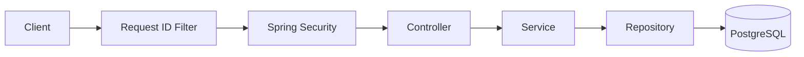

# OrderFlow

[](https://github.com/Levi-j/orderFlow-backend/actions/workflows/ci.yml)

OrderFlow is a Spring Boot backend for a small online store. It handles customers, products, inventory, and orders, with an emphasis on the parts of backend development where correctness matters: transactions, concurrency, authentication, safe retries, database integrity, and observability.

It is built as a modular monolith backed by PostgreSQL and can run either locally with Dockerized PostgreSQL or as a complete Docker Compose stack.

## Highlights

- **JWT authentication and role-based access** for customers and administrators
- **Transactional order placement** so orders, line items, inventory, and stock history succeed or roll back together
- **Concurrency-safe inventory updates** that prevent stock from becoming negative
- **Idempotent order creation** using `Idempotency-Key` for safe client retries
- **Optimistic locking** for conflicting order lifecycle changes
- **Historical order snapshots** so later product changes do not alter old orders
- **Request correlation and structured logging** using `X-Request-Id`
- **Flyway-managed PostgreSQL schema**
- **Real PostgreSQL integration testing** with Testcontainers
- **Dockerized runtime and GitHub Actions CI**

## Tech Stack

**Application**

- Java 21
- Spring Boot 4.1
- Spring MVC
- Spring Data JPA / Hibernate
- Spring Security
- Spring Boot Actuator
- PostgreSQL
- Flyway
- OpenAPI / Swagger UI

**Testing**

- JUnit
- REST Assured
- Testcontainers
- Maven Surefire and Failsafe

**Infrastructure**

- Maven Wrapper
- Docker
- Docker Compose
- GitHub Actions

## Architecture

OrderFlow is a modular monolith. The code is organized by business feature rather than by global technical layers.

```text
io.github.levij.orderflow
├── auth
├── common
├── inventory
├── order
├── product
└── user
```

A typical request flows through:



Controllers handle HTTP concerns, services contain business rules and transaction boundaries, and repositories handle persistence.

Cross-module access is kept deliberate: modules communicate through services rather than casually reaching into each other's repositories.

## Core Domain

### Products

Products represent the catalog and contain information such as SKU, name, price, and active state.

SKUs are unique and normalized to uppercase. Products are deactivated rather than deleted so historical references remain valid.

### Inventory

Inventory is modeled separately from products.

Each product has a current quantity and an inventory movement history. Stock changes are performed atomically in PostgreSQL so concurrent requests cannot oversell inventory.

Manual inventory adjustments are restricted to administrators.

### Orders

Customers can place orders containing one or more products.

OrderFlow calculates prices and totals on the server. Order items store snapshots of the product SKU, name, and price so historical orders remain unchanged if the catalog changes later.

New orders begin as `PENDING` and may become:

```text
PENDING
├── CONFIRMED
└── CANCELLED
```

Cancelling a pending order restores its inventory inside the same transaction.

## Correctness Under Concurrency

A major focus of the project is handling cases that simple CRUD applications often avoid.

### Atomic inventory updates

Inventory changes use conditional database updates rather than:

```text
read stock
check stock in Java
write stock
```

The database only performs a deduction when enough inventory exists at the moment the update executes.

This prevents overlapping requests from driving stock below zero.

### Transactional order placement

Creating an order affects several pieces of state:

- the order
- its order items
- inventory
- inventory movement history

These operations run inside one transaction.

If any part fails, the entire operation rolls back.

### Optimistic locking

Order lifecycle changes use optimistic locking.

If two requests attempt conflicting changes to the same order, a stale update is rejected instead of silently overwriting the newer state.

### Idempotent retries

`POST /api/v1/orders` requires an `Idempotency-Key`.

If a client loses the response after an order was successfully created, it can safely retry the same request using the same key.

A matching retry returns the original order instead of:

- creating another order;
- deducting inventory again; or
- creating duplicate inventory movements.

Reusing the same key for a different request is rejected with HTTP `409`.

A database uniqueness constraint also protects against duplicate requests arriving concurrently.

## Authentication and Authorization

Customers can register publicly and log in using the same authentication endpoint as administrators.

Successful login returns a signed JWT access token.

OrderFlow has two roles:

| Role | Main access |
| --- | --- |
| `CUSTOMER` | Customer order endpoints |
| `ADMIN` | Product, inventory, and administrative order endpoints |

Public routes include registration, login, the product catalog, health checks, and API documentation.

Authentication and authorization failures are returned consistently as JSON problem responses:

- `401` — authentication is missing or invalid
- `403` — the user is authenticated but does not have permission

Passwords are stored using BCrypt and are never returned by the API.

## API Overview

| Area | Main endpoints | Access |
| --- | --- | --- |
| Health | `GET /actuator/health` | Public |
| Registration | `POST /api/v1/auth/register` | Public |
| Login | `POST /api/v1/auth/login` | Public |
| Products | `GET /api/v1/products` | Public |
| Current user | `GET /api/v1/users/me` | Authenticated |
| Customer orders | `/api/v1/orders/**` | `CUSTOMER` |
| Product management | `/api/v1/admin/products/**` | `ADMIN` |
| Inventory management | `/api/v1/admin/inventory/**` | `ADMIN` |
| Order management | `/api/v1/admin/orders/**` | `ADMIN` |

The complete API can be explored through Swagger UI while the application is running:

```text
http://localhost:8080/swagger-ui.html
```

The generated OpenAPI document is available at:

```text
http://localhost:8080/v3/api-docs
```

## Error Responses

API errors use `application/problem+json`.

For example:

```json
{
  "status": 404,
  "title": "Not Found",
  "detail": "Product 999999 not found",
  "instance": "/api/v1/products/999999",
  "code": "RESOURCE_NOT_FOUND",
  "requestId": "demo-123"
}
```

The application uses the usual HTTP distinction between validation errors, authentication failures, authorization failures, missing resources, conflicts, and unexpected server errors.

Internal exception details, SQL errors, and stack traces are not returned to clients.

## Request IDs and Logging

Every HTTP response includes an `X-Request-Id`.

The same ID is attached to application logs while the request is being processed and is also included in API error responses.

That makes it possible to move from a client-visible error:

```text
X-Request-Id: demo-123
```

to the corresponding server logs.

OrderFlow produces concise access logs containing information such as:

```text
method=POST path=/api/v1/orders status=201 durationMs=17
```

Important business operations also emit structured events.

Containerized execution uses Spring Boot's ECS JSON logging support, while normal host development uses readable text logs.

Sensitive values such as passwords, JWTs, authorization headers, request bodies, idempotency keys, and request fingerprints are intentionally excluded from application logging.

## Database

Flyway owns the database schema.

Migrations live under:

```text
src/main/resources/db/migration
```

Current migrations cover:

```text
V1  products
V2  users
V3  inventory
V4  orders
V5  optimistic locking
V6  order idempotency
```

Hibernate runs with schema validation rather than creating or modifying production tables.

Important rules are enforced both in application code and, where appropriate, with PostgreSQL constraints.

Money uses Java `BigDecimal` and PostgreSQL `NUMERIC`.

## Running the Project

### Requirements

For the complete Docker setup:

- Docker
- Docker Compose

For local Java development:

- JDK 21
- Docker for PostgreSQL and Testcontainers

A global Maven installation is not required because the repository includes the Maven Wrapper.

### 1. Configure the environment

Copy the example environment file.

PowerShell:

```powershell
Copy-Item .env.example .env
```

Linux/macOS:

```bash
cp .env.example .env
```

Set a valid `ORDERFLOW_JWT_SECRET` in `.env`.

The JWT secret must be at least 32 bytes when encoded as UTF-8.

An administrator can optionally be bootstrapped with:

```text
ORDERFLOW_ADMIN_EMAIL=admin@example.com
ORDERFLOW_ADMIN_PASSWORD=<password>
```

Both values must either be present together or left blank.

### 2. Run the complete stack

```powershell
docker compose --profile app up --build -d
```

This starts PostgreSQL and the OrderFlow application.

Check the containers:

```powershell
docker compose --profile app ps
```

Then verify the application:

```powershell
curl.exe http://localhost:8080/actuator/health
```

A healthy application reports:

```json
{
  "status": "UP"
}
```

Open Swagger UI:

```text
http://localhost:8080/swagger-ui.html
```

To stop the stack:

```powershell
docker compose --profile app down
```

The PostgreSQL volume is preserved.

> `docker compose down -v` also removes the database volume and its stored data.

### Host development

To run only PostgreSQL:

```powershell
docker compose up -d
```

Then start Spring Boot on the host:

```powershell
.\mvnw.cmd spring-boot:run
```

On Linux/macOS:

```bash
./mvnw spring-boot:run
```

The API is available at:

```text
http://localhost:8080
```

## Testing

The fast test suite does not require Docker:

```powershell
.\mvnw.cmd test
```

The complete verification build is:

```powershell
.\mvnw.cmd clean verify
```

Integration tests use Testcontainers to start temporary PostgreSQL databases.

The suite covers areas including:

- authentication and authorization
- validation and error handling
- PostgreSQL constraints
- product and inventory operations
- transactional order placement
- rollback behavior
- customer ownership isolation
- order cancellation and confirmation
- inventory restoration
- idempotency
- optimistic locking
- concurrent stock updates
- request correlation
- logging safety
- OpenAPI generation

Concurrency tests use real PostgreSQL transactions and verify the resulting database state rather than assuming which request should win a race.

## Continuous Integration

GitHub Actions runs the full Maven verification build for pushes and pull requests targeting `main`.

After the test suite succeeds, CI also builds the Docker image:

```text
docker build --tag orderflow:ci .
```

The workflow verifies the image but does not publish or deploy it.

## Docker Image

The Dockerfile uses a multi-stage build.

The build stage uses a Java 21 JDK and Maven Wrapper to package the application.

The runtime image contains only the Java 21 JRE and application JAR and runs as an unprivileged `orderflow` user.

Application secrets are supplied at runtime and are not included in the image.

## Why a Modular Monolith?

Order placement changes orders, order items, inventory, and inventory history together.

Keeping these operations inside one application and database allows them to use normal database transactions without introducing distributed coordination simply for architectural complexity.

The feature packages still provide clear boundaries while keeping the system straightforward to run and reason about.

## Project Structure

## Project Structure

```text
orderFlow-backend/
├── .github/
│   └── workflows/
├── src/
│   ├── main/
│   │   ├── java/io/github/levij/orderflow/
│   │   │   ├── auth/
│   │   │   │   └── dto/
│   │   │   ├── common/
│   │   │   │   ├── config/
│   │   │   │   ├── error/
│   │   │   │   └── web/
│   │   │   ├── inventory/
│   │   │   │   └── dto/
│   │   │   ├── order/
│   │   │   │   └── dto/
│   │   │   ├── product/
│   │   │   │   └── dto/
│   │   │   ├── user/
│   │   │   │   └── dto/
│   │   │   └── OrderFlowApplication.java
│   │   └── resources/
│   │       ├── db/migration/
│   │       │   ├── V1__create_products_table.sql
│   │       │   ├── V2__create_users_table.sql
│   │       │   ├── V3__create_inventory_tables.sql
│   │       │   ├── V4__create_orders_tables.sql
│   │       │   ├── V5__add_order_version.sql
│   │       │   └── V6__add_order_idempotency.sql
│   │       └── application.yml
│   └── test/
│       ├── java/io/github/levij/orderflow/
│       │   ├── auth/
│       │   ├── common/web/
│       │   ├── inventory/
│       │   ├── order/
│       │   ├── product/
│       │   ├── support/
│       │   ├── user/
│       │   └── database/API integration tests
│       └── resources/
├── .dockerignore
├── .env.example
├── compose.yaml
├── Dockerfile
├── pom.xml
├── mvnw
├── mvnw.cmd
└── README.md
```

## Scope

OrderFlow is intentionally a backend-focused project rather than a complete e-commerce platform.

It does not currently include payment processing, shipping, a shopping cart, refresh tokens, password reset, centralized observability infrastructure, or a customer-facing frontend.

The project stops at the point where its core goal is demonstrated: building a small backend whose authentication, transactions, inventory, retries, concurrency behavior, database schema, logging, tests, and containerized runtime are designed deliberately rather than added as afterthoughts.